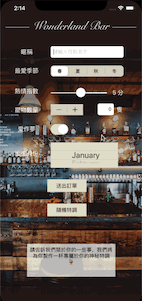

# Wonderland Bar
This app is an exercise of basic UI elements.
- Label
- Button
- Swich
- Stepper
- Text Field
- Picker View
- Slider
- SpriteKit
- Gradient Layer

### Medium Articles
For more details about this app, please see Medium articles:
 
[Wonderland Bar #1 UI元件](https://medium.com/%E5%BD%BC%E5%BE%97%E6%BD%98%E7%9A%84-swift-ios-app-%E9%96%8B%E7%99%BC%E6%95%99%E5%AE%A4/swift-%E7%B7%B4%E7%BF%92-wonderland-bar-8ecd7876b7e8)
 
[Wonderland Bar #2 鍵盤, Picker View, SpriteKit, Status Bar Colours](https://medium.com/%E5%BD%BC%E5%BE%97%E6%BD%98%E7%9A%84-swift-ios-app-%E9%96%8B%E7%99%BC%E6%95%99%E5%AE%A4/swift-%E7%B7%B4%E7%BF%92-wonderland-bar-2-dccbde942003)
 
[Wonderland Bar #3 MVC, Segue](https://medium.com/%E5%BD%BC%E5%BE%97%E6%BD%98%E7%9A%84-swift-ios-app-%E9%96%8B%E7%99%BC%E6%95%99%E5%AE%A4/swift-%E7%B7%B4%E7%BF%92-wonderland-bar-3-9ca934253c97)

# Demo
 
 
